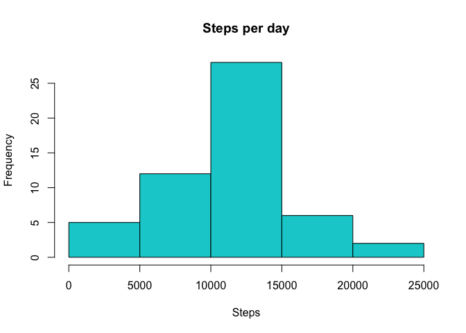
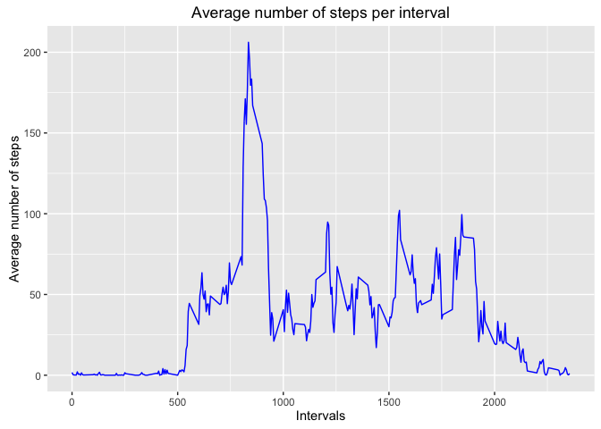
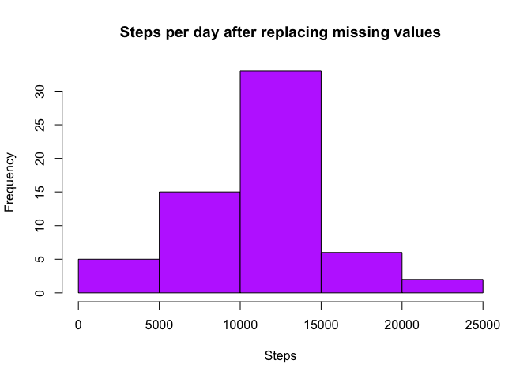
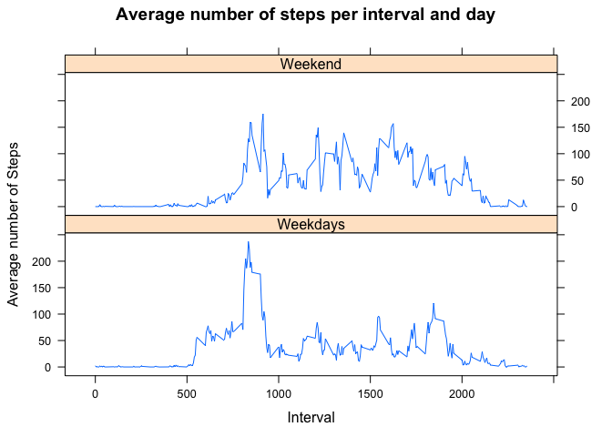

# Reproducible Research: Peer Assessment 1
Marianscon  


## Introduction

It is now possible to collect a large amount of data about personal movement using activity monitoring devices such as a Fitbit, Nike Fuelband, or Jawbone Up. These data remain under-utilized both because the raw data are hard to obtain and there is a lack of statistical methods and software for processing and interpreting the data.

This assignment makes use of data from a personal activity monitoring device. This device collects data at 5 minute intervals through out the day. The data consists of two months of data from an anonymous individual collected during the months of October and November, 2012 and include the number of steps taken in 5 minute intervals each day.

Dataset: Activity Monitoring Data [52K]

Variables: 

* **steps** - Number of steps taking in a 5-minute interval (missing values are coded as NA)

* **date** - The date on which the measurement was taken in YYYY-MM-DD format

* **interval** - Identifier for the 5-minute interval in which measurement was taken

The dataset is stored in a comma-separated-value (CSV) file and there are a total of 17,568 observations in this dataset.

## Loading and preprocessing the data

#### 1. loading the data

```r
library(ggplot2)
library(plyr)
activityData <- read.csv("activity.csv")
```
#### 2. processing the data

```r
activityData$day <- weekdays(as.Date(activityData$date))
activityData$DateTime<- as.POSIXct(activityData$date, format="%Y-%m-%d")
```
## What is mean total number of steps taken per day?
#### 1.Calculate the total number of steps taken per day


```r
numberSteps <- aggregate(activityData$steps ~ activityData$date, FUN=sum, )
colnames(numberSteps)<- c("Date", "Steps")
```

#### 2. Make a histogram of the total number of steps taken each day

```r
hist(numberSteps$Steps, breaks=5, xlab="Steps", main = "Steps per day", col='darkturquoise')
```



#### 3. Calculate and report the mean and median of the total number of steps taken per day

The mean of the total number of steps is:

```r
as.integer(mean(numberSteps$Steps)) 
```

```
## [1] 10766
```

and the median is:

```r
as.integer(median(numberSteps$Steps)) 
```

```
## [1] 10765
```

## What is the average daily activity pattern?

#### 1. Make a time series plot (i.e. type = "l") of the 5-minute interval (x-axis) and the average number of steps taken, averaged across all days (y-axis)
 

```r
noNas <- activityData[!is.na(activityData$steps),] ## eliminates missing values 
intervals <- ddply(noNas, .(interval), summarize, average = mean(steps))

## line plot of average number of steps per interval
p <- ggplot(intervals, aes(x=interval, y=average), xlab = "Interval", ylab="Average number of steps", )
p + geom_line(color='blue')+xlab("Intervals")+ylab("Average number of steps")+ggtitle("Average number of steps per interval")
```



#### 2. Which 5-minute interval, on average across all the days in the dataset, contains the maximum number of steps?

The maximum amount of steps occurs in the 5-minute interval number:

```r
maxSteps <- max(intervals$average) ## Maximum steps by interval
intervals[intervals$average==maxSteps,1]
```

```
## [1] 835
```

## Imputing missing values

#### 1. Calculate and report the total number of missing values in the dataset 

The number of missing values is:


```r
nrow(activityData[is.na(activityData$steps),])
```

```
## [1] 2304
```

#### 2. Devise a strategy for filling in all of the missing values in the dataset. The strategy does not need to be sophisticated. For example, you could use the mean/median for that day, or the mean for that 5-minute interval, etc.

My strategy is to replace the missing values with the 5-minute intervals mean of the particular day.

```r
stepMean <- ddply(noNas, .(interval, day), summarize, average = mean(steps))
Nas<- activityData[is.na(activityData$steps),]
noNasData<-merge(Nas, stepMean, by=c("interval", "day"))    
```
    
#### 3. Create a new dataset that is equal to the original dataset but with the missing data filled in.

```r
FinData<- noNasData[,c(6,4,1,2,5)]
colnames(FinData)<- c("steps", "date", "interval", "day", "DateTime")
merged <- rbind(noNas, FinData)    
```
    
#### 4. Make a histogram of the total number of steps taken each day and Calculate and report the mean and median total number of steps taken per day. 


```r
stepsDay <- aggregate(merged$steps ~ merged$date, FUN=sum, )
colnames(stepsDay)<- c("Date", "Steps")
hist(stepsDay$Steps, breaks=5, xlab="Steps", main = "Steps per day after replacing missing values", col="darkorchid1")
```



The mean of the steps taken per day, after replacing the missing values is:

```r
as.integer(mean(stepsDay$Steps))
```

```
## [1] 10821
```
and the median is:

```r
as.integer(median(stepsDay$Steps))
```

```
## [1] 11015
```

##### Do these values differ from the estimates from the first part of the assignment? What is the impact of imputing missing data on the estimates of the total daily number of steps?

The mean, after replacing the missing values, is 10821 steps compared to the original mean of 10766 steps. This represents a 0.5% increase. On  the other hand, the new median is 11015 steps whereas the original median is 10765 steps, a 2% decrease. Both differences are so small, we can conclude our strategy for replacing the missing data did not have a great impact on the output. 

## Are there differences in activity patterns between weekdays and weekends?
   
#### 1. New factor variable in the dataset with two levels – “weekday” and “weekend” indicating whether a given date is a weekday or weekend day.


```r
merged$DayCategory <- ifelse(merged$day %in% c("Saturday", "Sunday"), "Weekend", "Weekdays")
```

#### 2. Panel plot containing a time series plot of the 5-minute interval (x-axis) and the average number of steps taken, averaged across all weekday days or weekend days (y-axis). 


```r
library(lattice)
weekDayEnd <- ddply(merged, .(interval, DayCategory), summarize, average = mean(steps))
xyplot(average~interval|DayCategory, data=weekDayEnd, type="l",  layout = c(1,2),
       main="Average number of steps per interval and day", 
       ylab="Average number of Steps", xlab="Interval")
```



It is easy to see that the average number of steps is larger during the weekend. 
